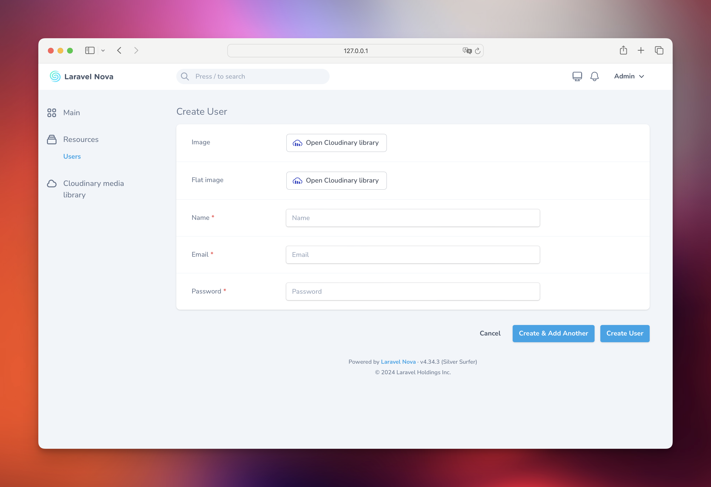
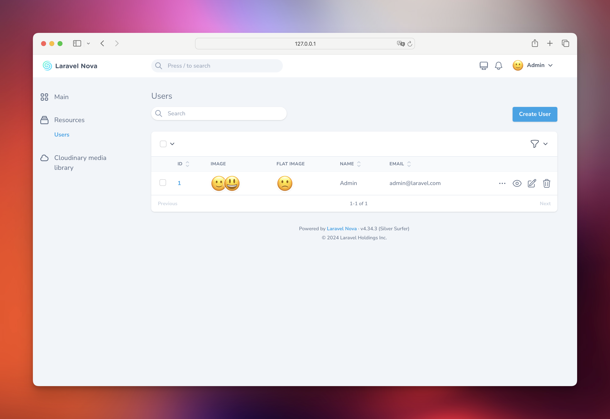
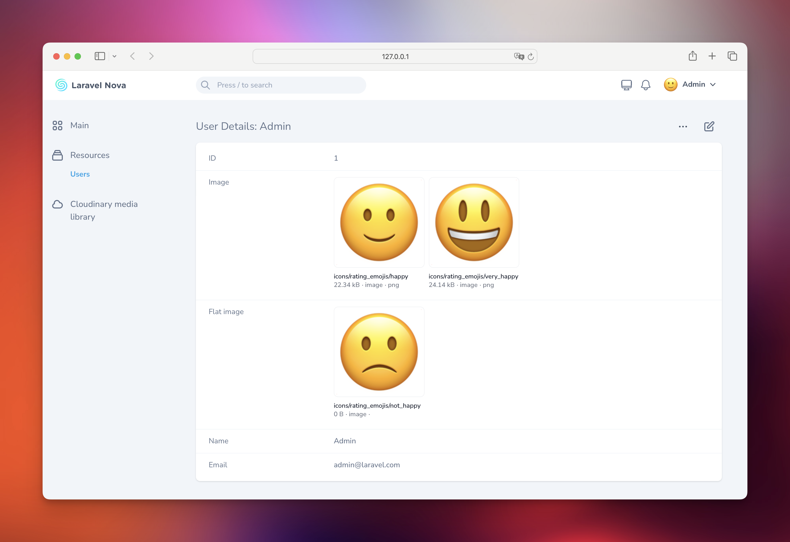
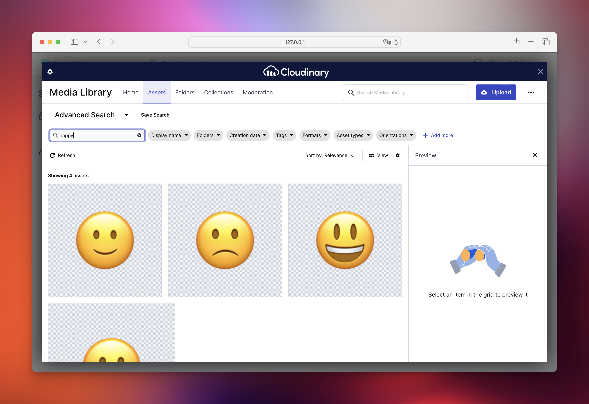
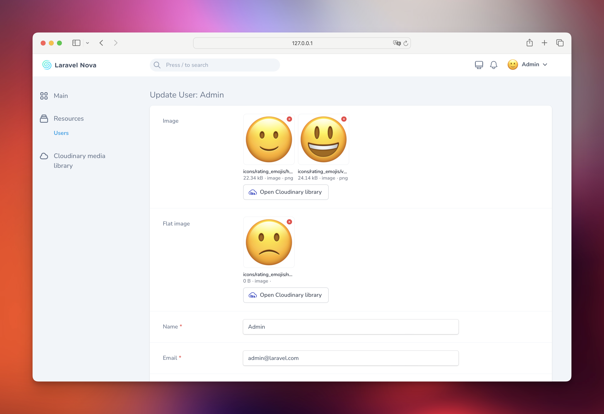
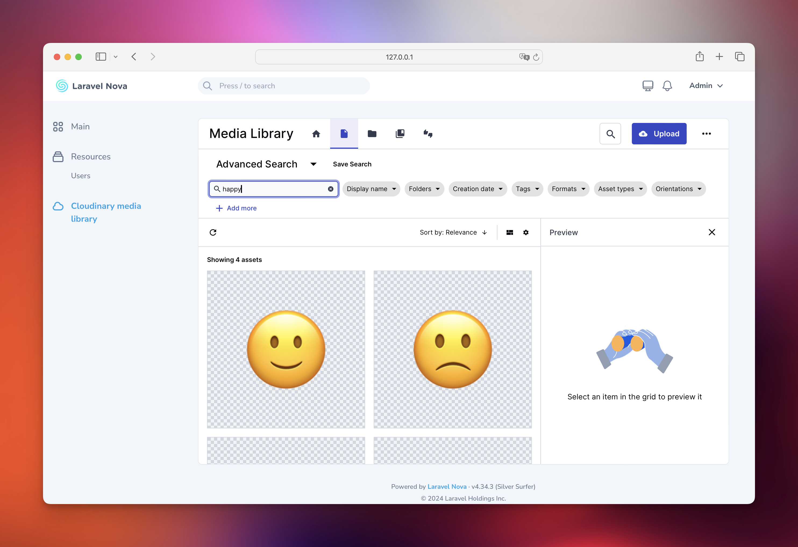

# Laravel Nova Cloudinary field

[](https://packagist.org/packages/bbs-lab/nova-cloudinary-field)
[](LICENSE.md)
[](https://packagist.org/packages/bbs-lab/nova-cloudinary-field)

A Cloudinary Media Library field and tool for Laravel Nova.



## Contents

- [Installation](#installation)
- [Usage](#usage)
- [Advanced usage](#advanced-usage)
    - [Multiple selection](#multiple-selection)
    - [Limit the number of selected files](#limit-the-number-of-selected-files)
    - [On-demand configuration](#on-demand-configuration)
    - [Dependent Fields](#dependent-fields)
- [Screenshots](#screenshots)
    - [List view](#list-view)
    - [Detail view](#detail-view)
    - [Form view](#form-view)
- [Changelog](#changelog)
- [Security](#security)
- [Contributing](#contributing)
- [Credits](#credits)
- [License](#license)

## Installation

You can install the package via composer:

``` bash
composer require bbs-lab/nova-cloudinary-field
```

The package will automatically register itself.

You can publish the config-file with:

```bash
php artisan vendor:publish --provider="BBSLab\CloudinaryField\CloudinaryFieldServiceProvider" --tag="config"
```

This is the contents of the published config file:

```php
<?php

declare(strict_types=1);

return [

    'default' => [
        'cloud' => env('NOVA_CLOUDINARY_DEFAULT_CLOUD'),
        'username' => env('NOVA_CLOUDINARY_DEFAULT_USERNAME'),
        'key' => env('NOVA_CLOUDINARY_DEFAULT_KEY'),
        'secret' => env('NOVA_CLOUDINARY_DEFAULT_SECRET'),
    ],

];
```

## Usage

You can use the `BBSLab\CloudinaryField\Cloudinary` field in your Nova resource:

```php
<?php

namespace App\Nova;

declare(strict_types=1);

namespace App\Nova;

class BlogPost extends Resource
{
    // ...
    
    public function fields(Request $request)
    {
        return [
            // ...

            Cloudinary::make('Image'),

            // ...
        ];
    }
    
}
```

> [!IMPORTANT]
> By default the field stores an array of data, you **must** cast your attribute as an `array`.


## Advanced usage

### Multiple selection

When using the `Cloudinary` field on your Nova resource, you can tell the tool to allow multiple selection for your attribute.

By default, the tool will only allow single selection.

```php
<?php

declare(strict_types=1);

namespace App\Nova;

use BBSLab\CloudinaryField\Cloudinary;

class BlogPost extends Resource
{
    // ...
    
    public function fields(Request $request)
    {
        return [
            // ...

            Cloudinary::make('Image')
                ->multiple(),

            // ...
        ];
    }
    
}
```

### Limit the number of selected files

You can limit the number of selected files by using the `limit` method.

```php
<?php

declare(strict_types=1);

namespace App\Nova;

use BBSLab\CloudinaryField\Cloudinary;

class BlogPost extends Resource
{
    // ...
    
    public function fields(Request $request)
    {
        return [
            // ...

            Cloudinary::make('Image')
                ->multiple()
                ->limit(10),

            // ...
        ];
    }
    
}
```

### On-demand configuration

You can use the following methods to set some configuration on the field:

- `cloud(string $cloud)`: Set the cloud name.
- `username(string $username)`: Set the username.
- `key(string $key)`: Set the API key.
- `secret(string $secret)`: Set the API secret.

Also, you can use the `configureUsing` method to set the configuration on the field:

```php
<?php

declare(strict_types=1);

namespace App\Nova;

use BBSLab\CloudinaryField\Cloudinary;use Laravel\Nova\Http\Requests\NovaRequest;

class BlogPost extends Resource
{
    // ...
    
    public function fields(Request $request)
    {
        return [
            // ...

            Cloudinary::make('Image')
                ->configureUsing(function (NovaRequest $request) {
                    return [
                        'cloud' => 'my_cloud',
                        'username' => 'my_username',
                        'key' => 'my_key',
                        'secret' => 'my_secret',
                    ];
                });

            // ...
        ];
    }
    
}
```

### Dependent Fields

You may use the `dependsOn` method to conditionally display the field based on the value of another field. See the example below:

```php
<?php

declare(strict_types=1);

namespace App\Nova;

use BBSLab\CloudinaryField\Cloudinary;
use Laravel\Nova\Fields\Boolean;
use Laravel\Nova\Fields\FormData;
use Laravel\Nova\Fields\ID;
use Laravel\Nova\Fields\Text;
use Laravel\Nova\Http\Requests\NovaRequest;

class BlogPost extends Resource
{
    // ...

    public function fields(NovaRequest $request): array
    {
        return [
            ID::make()->sortable(),

            Text::make('Title')
                ->sortable()
                ->rules('required', 'max:255'),

            Boolean::make('Has Image')
                ->sortable()
                ->rules('required'),

            Cloudinary::make('Image')
                ->rules('nullable')
                ->fullWidth()
                ->hide()
                ->dependsOn('has_image', function (Cloudinary $field, NovaRequest $request, FormData $formData) {
                    if ($formData->has_content) {
                        $field
                            ->show()
                            ->rules('required');
                    } else {
                        $field->hide();
                    }
                }),
        ];
    }
}
```

> [!TIP]
> More information about dependent fields can be found in the [official documentation](https://nova.laravel.com/docs/resources/fields.html#dependent-fields).

## Tool

The package also provides a tool to directly access the Cloudinary Media Library.

You may register the tool in your `NovaServiceProvider`:

```php
<?php

declare(strict_types=1);

namespace App\Providers;

use BBSLab\CloudinaryField\NovaCloudinary;
use Laravel\Nova\NovaApplicationServiceProvider;

class NovaServiceProvider extends NovaApplicationServiceProvider
{
    // ...

    public function tools(): array
    {
        return [
            NovaCloudinary::make(),
        ];
    }
}

```

## Screenshots

### Index



### Detail



### Form





### Tool


## Changelog

Please see [CHANGELOG](CHANGELOG.md) for more information what has changed recently.

## Security

If you discover any security related issues, please email paris@big-boss-studio.com instead of using the issue tracker.

## Contributing

Please see [CONTRIBUTING](CONTRIBUTING.md) for details.

## Credits

- [Mikaël Popowicz](https://github.com/mikaelpopowicz)
- [All Contributors](../../contributors)

## License

The MIT License (MIT). Please see [License File](LICENSE.md) for more information.
